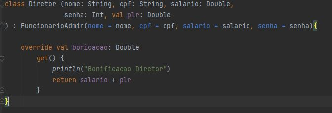

# INFORMAÇÕES KOTLIN

* Link documentação kotlin: [Documentação Kotlin](https://kotlinlang.org/docs/control-flow.html#for-loops)

Para rodar o kotlin geralmente é inserido nas pastinhas sempre em azul.
E criar com file.

Para executar todo programa, colocar:

        fun main (){
            print("Hello World")
        }
* Lembrando que tem que ser aspa dupla.

Toda vez que for executado o kotlin ele gera uma pasta chamada `out`, pasta de saida do compilado.

## Criar variaveis.
Precisamos definir a variavel se ela pode mudar seu valor ou não.

* var = permite modificar valor 
* val = não permite mudar o nome
        
        val titular = " Edrielle"

Ao chamar a variavel titular, sendo que ela é uma val, que não ira mudar, ele já informa que 
é uma string.

Ao executar aparece nome colocado devido nosso Hellow World, para pular linha,
teremos que executar como: `println(titular)`, pois ai o <b>println</b> faz a referência a pulo de linha.

Podemos concatenar como nas outras ligaguens:

        val titular = "Edri"
        println("titular" + titular)

Ou usaremos o string template com o $nomevariavel com o . ${nome.atribuicao}:

        val titular = "Edri"
        println("titular $titular")

<b>VAL VOCÊ NÃO MODIFICA VALOR:</b>

       val titular = "Edri"
       titular = "dri"  // não vai funcionar pq é uma val

Ao declarar uma variável o kotlin exige que você faz uma inicialização da mesma:
Exemplo: 
        
            var titular; //não funciona

O padrão, quando nós criamos uma variável pela primeira vez e nós não temos a intenção de mudar o valor, é justamente trabalhar com val, porque nós já vamos ter que inicializar com um valor que nós esperamos, nesse caso pode ser o Alex e então nós já garantimos essa questão de inicialização e que não vai mudar esse valor.

É uma boa prática de programação também até mesmo para evitar problemas mais avançados conforme você for ganhando experiência você vai entendendo, mas esse é um tipo de feedback muito importante quando nós estamos trabalhando aqui e criando as nossas primeiras variáveis.

Inicialmente nós começamos com val e só no momento que realmente for necessário modificar esse valor, nós vamos lá e migramos para o var.

Inclusive, até mesmo o Kotlin já deixa bem claro, você está fazendo aqui o seu titular, você inicializou aqui, mas aqui você está fazendo uma inicialização redundante você já poderia colocar esse valor aqui em cima, dado que você não está trabalhando com esse valor.

No Kotlin segue mesmo padrão java ao criar uma variavel, informar se ela é uma string, int, double, ex:
        
        fun main (){
        println("Hello World")
        
            val titular: String = "Edrielle"
            val numeroConta: Int = 10
            var saldo: Double = 0.0
            saldo = 100.0
            saldo += 200
            println("titular $titular")
            println("Numedo da conta $numeroConta")
            println("Numero do saldo $saldo")
        }

* Tipos de ponto flutuante
  Os tipos de ponto flutuante representam números com um decimal, como 9,99 ou 3,14515.

Os tipos de dados Float e Double podem armazenar números fracionários:

* Float exemplo:

        val myNum: Float = 5.75F
        println(myNum)

* Double Exemplo:

       val myNum: Double = 19.99
       println(myNum)

- Usar Float ou Double?

A precisão de um valor de ponto flutuante indica quantos dígitos o valor pode ter após o ponto 
decimal. A precisão de Float é de apenas seis ou sete dígitos decimais, enquanto Double as
variáveis têm uma precisão de cerca de 15 dígitos. Portanto, é mais seguro usar Double para a 
maioria dos cálculos.

Observe também que você deve terminar o valor de um Floattipo com um "F".

## Condição.
<b>IF/ELSE:</b>

        var saldo = 1000
        saldo += 209
        saldo = 0.00

        if( saldo > 0.0){
            println("conta positiva")
        } else if(saldo == 0.0){
            println("falso")
        } else {
            println("falso")
        }

<b> WHEN: </b>

Alt + enter: ele da a opção de alternar if para o when.

    when {
        saldo > 0.0 -> {
            println("conta positiva")
        }
        saldo == 0.0 -> {
            println("falso")
        }
        else -> {
            println("falso")
        }
    }

* O when pode ser executado em uma linha, mais encurtado e ele é igual/próximo ao switch/case.
Utilizamos mais o if e o when.

        Lembre-se que o plugin do Kotlin para o IntelliJ verifica as possíveis conversões. 
        Para isso, utilize o atalho Alt + Enter quando aparecer o código sublinhado.

## Estrutura de repetição
* Nesse for, é como se tivesse um range, relembrando python..
  dizendo que tem a variavel iniciador `i` e ele vai inicar no `1..3`, dizendo que vai do 1 ao 3.
  Como se fosse em python: for i in range(1, 3).

        for (i in 1..3){
            println(i)
        }

* Atalho ctrl + alt + l = formatação.

Caso queira for de 5 até 1 colocar downTo

        for(i in 5 downTo 1){

        }

* Step - faz pular interação, pular de 1 em 1 ou 2 em 2

         for(i in 5 downTo 1 step 5){

         }

## Classes
* Nome da classe tem que ser maiuscula.
* Função não precisa

Classe criada:

      class modelo.Conta {
        var titular: String = ""
        var numero = 0
        var saldo = 0.0
      }

Exemplo criado com classe:

      fun main() {

        var contaCorrenteEdrielle = modelo.Conta()
        contaCorrenteEdrielle.titular = "Edrielle"
        contaCorrenteEdrielle.numero = 100
        contaCorrenteEdrielle.saldo = 200.0
    
        println("Bem vindo ao bytebank ${contaCorrenteEdrielle.titular}")
    
        println()
    
        var contaFran = modelo.Conta()
        contaFran.titular = "Franciele"
        contaFran.numero = 101
        contaFran.saldo = 200.99
    
        println(contaFran.saldo)
    
        println("Bem vindo $contaFran.titular")
    
        println("Depositando na conta da Fran")
        deposita(contaFran, 50.0)
        println(contaFran.saldo)
    }

    fun deposita(conta: modelo.Conta, valor: Double){
    conta.saldo += valor
    }

* fun deposita é uma função que recebe o parametro conta que vai ser do tipo `modelo.Conta` referente a classe criada 
`modelo.Conta` e o segundo parametro o valor que é do tipo Double, `valor: Double`. O conta pra puxar na função é só chamar
o parametro que foi atribuido a modelo.Conta, que no caso foi conta e colocar o . para chamar, assim ficando:
`conta.saldo`, saldo quue é propriedade da classe `modelo.Conta`.

## Implementando os métodos
Vamos jogar um comportamento pra dentro da classe:

        class modelo.Conta {
          var titular: String = ""
          var numero = 0
          var saldo = 0.0
          
          fun deposita(valor: Double){
             this.saldo += valor
          }      
        }
        
        println("Depositando na conta da Fran")
        contaFran.deposita(1000.01)
        println(contaFran.saldo)

* No caso não precisamos mais atribuir o conta, para referenciar o próprio objeto, se utiliza o `this`
no caso `this.saldo`

Nós podemos usar um valor, por exemplo, do tipo Boolean que ele tem duas opções que seria true para quando
ocorreu tudo bem e o false para quando não ocorreu, que é aqui seria o true return true e agora quando o if ele não
funciona, já começa por ele mesmo, nós colocamos um else e coloca aqui um return false, então nós podemos estar usando
dessa maneira.

Só que quando nós utilizamos esse tipo de técnica no Kotlin, nós a princípio vamos ter esse problema falando que nós
estamos tentando enviar um Boolean só que o que é esperado é esse tipo Unit, o que que ele representa.

No caso aqui do Kotlin, quando nós não falamos nada nós estamos indicando também que nós não queremos retornar nada, 
só que aqui no Kotlin nós sempre vamos retornar alguma coisa e por padrão quando nós indicamos que nós não queremos 
retornar nada, nós estamos retornando uma referência chamada de Unit.

Como nós podemos até mesmo ver aqui, na mensagem fala que o que é esperado é esse tipo Unit, ou seja, por padrão, 
implicitamente, escondido existe ali esse tal Unit e como que nós podemos entender como que nós retornamos algo ou não? 
A regra aqui no Kotlin é adicionar os dois pontos, dar um espaço e coloca o tipo
`fun transfere(valor: Double, destino: modelo.Conta): Unit.`

Então se nós colocarmos esse tal de Unit como nós estamos vendo aqui, o nosso código ele realmente fica até cinza 
falando o seguinte, que o Unit ele é desnecessário, é redundante fazermos isso, porque por padrão é ele que é retornado.

Por isso que sempre retorna alguma coisa mas no caso do Unit, quando nós estamos retornando essa referência significa
que não tem nada a retornar, mas é ela que está sendo retornada.

E se caso nós quisermos mudar o Unit? Quiser ir para Boolean? Basicamente nós colocamos um Boolean aqui
`fun transfere(valor: Double, destino: modelo.Conta): Boolean` que ele vai lá e faz o retorno bonito para nós.

Classe feita:

      class modelo.Conta {
        var titular: String = ""
        var numero = 0
        var saldo = 0.0
    
        fun deposita(valor: Double) {
            this.saldo += valor
        }
    
        fun saca(valor: Double) {
            if (this.saldo > valor) {
                this.saldo -= valor
            } else if (this.saldo < valor) {
                println("Valor do saque: $valor e maior do que do saldo ${this.saldo}")
            }
        }
    
        fun transferencia(valor: Double, destino: modelo.Conta): Boolean {
            if (this.saldo >= valor) {
                this.saldo -= valor
                destino.saldo += valor
                return true
            }
            return false
        }
      }

Ao chamar na fun main() {}:

            var contaCorrenteEdrielle = modelo.Conta()
            contaCorrenteEdrielle.titular = "Edrielle"
            contaCorrenteEdrielle.numero = 100
            contaCorrenteEdrielle.saldo = 200.0
        
            println("Bem vindo ao bytebank ${contaCorrenteEdrielle.titular}")
        
            println()
        
            var contaFran = modelo.Conta()
            contaFran.titular = "Franciele"
            contaFran.numero = 101
            contaFran.saldo = 200.0
        
            println("Bem vindo ${contaFran.titular}")
      
      //    println("Depositando na conta da Fran")
      //    contaFran.deposita(1000.01)
            println(contaFran.saldo)
        
            println("Sacando conta FRAN")
            contaFran.saca(20.0)
            println(contaFran.saldo)
        
            println("Transferencia da conta da fran pra edrielle")
            if (contaFran.transferencia(10.0, contaCorrenteEdrielle)) {
                println("Transferencia ocorreu com sucesso")
            } else {
                println("Falha na conta")
            }
        
            println(contaCorrenteEdrielle.saldo)
            println(contaFran.saldo)

## Encapsulamento Getter e Setter

Para que ninguem acesse uma variavel e modifica, criamos uma função na qual retorna apenas
o valor da variaval, vamos supor no ex abaixo:

        class modelo.Conta(){
            private var saldo  = 0.0
            
            * criar a função na qual vai mostrar pq como é private não vai ser chamado diretamente.
            * lembrando que pode ser qualuquer nome, get, getter, devolve
            * lembrando aqui que tem que colocar o tipo que retorna, nesse caso um Double.
            
            fun getSaldo(): Double{
                return this.saldo // saldo
            }
            
            * Set é mais para setar o valor na qual é private e quero modificar, conform o getter
            pode ter qualquer nome.

            fun setSaldo(valor: Double){
               if(valor > 0)
               this.saldo = valor
            }
        }

## Utilizando properties
Escreva um código mais idiomático com o Kotlin utilizando property ao invés de métodos de acesso para o saldo.

Para isso, remova o getter e setter que foi implementado para o saldo, em seguida, ajuste o código para que utilize
a property saldo.

Após ajuste, adicione a lógica que impede valores negativos via método deposita(), então deixe o setter do saldo
privado para que apenas a própria classe altere o seu valor diretamente.

Por fim, modifique o código para que adicione saldo via deposita() e leia o saldo via property. Então remova os
comentários dos códigos anteriores, rode o programa e confira se funciona como esperado.

        class modelo.Conta {
          var titular: String = ""
          var numero = 0
          var saldo = 0.0
              private set  // informa que saldo é privado e so a classe ira modificar, 
                            // valor modificado atraves da função deposita.
      
      
          fun deposita(valor: Double) {
              if(valor > 0) {
                  this.saldo += valor
              }
          }
      
          fun saca(valor: Double) {
              if (this.saldo > valor) {
                  this.saldo -= valor
              } else if (this.saldo < valor) {
                  println("Valor do saque: $valor e maior do que do saldo ${this.saldo}")
              }
          }
      
          fun transferencia(valor: Double, destino: modelo.Conta): Boolean {
              if (this.saldo >= valor) {
                  this.saldo -= valor
                  destino.deposita(valor)
                  return true
              }
              return false
          }
        }

<b>Pergunta: </b>Properties apresentam o mesmo comportamento de métodos de acesso e é mais idiomático ao Kotlin.
   - <b>Resposta:</b> Exatamente! Todas os campos do Kotlin são properties, portanto, não existe a necessidade 
    de implementar métodos de acesso.

<b>Pergunta: </b>PeNão é necessário escrever setter ou getter ao utilizar property.

- <b>Resposta :</b> Isso mesmo! Dada a ideia de que a boa prática em Orientação a Objetos é acessar campos
via métodos de acesso, com properties apenas escrevemos o comportamento diferente quando for necessário.

## Criando contas com construtor
* E tem constructor primario que recebe os parametros nos parenteses na ca chamada.

        class modelo.Conta(var titular: String, var numero: Int) {
           var saldo = 0.0
           private set
        }
Ou:

        class modelo.Conta(titular: String, numero: Int) {
          var titular = titular
          var numero = numero
          var saldo = 0.0
              private set 
        }

* Construtor igual do typescript o segundario, com this e passando o tipo.

        class modelo.Conta {
          var titular: String
          var numero: Int
          var saldo = 0.0
              private set
      
          constructor(titular: String, numero: Int){
              this.titular = titular
              this.numero = numero
          }
        }

## Utilizando labels
* Posso mandar se quero inicializar o valor ou não, modo opcional, conforme abaixo;
      
          val numero: Int = 0 

Vai dizer que é 0 caso não passe o valor no parametro.

* Para deixar que receba o parametro: 
          
          val numero: Int

Podemos passar nome do parametro que passamos para receber e seu valor e alterar a ordem mas 
passando seu identificador, ex:

          var contaCorrenteEdrielle = modelo.Conta(titular = "Edrielle", numero = 10000)

Posso inverter mas passando seu identidicador que não altera:

          var contaCorrenteEdrielle = modelo.Conta(numero = 1000, titular = "Edrielle")

Isso funciona para o constructor e para funções/nosso metodos:

          if (contaFran.transferencia(valor = 10.0, destino = contaCorrenteEdri)) { //ou destino = contaEdri, valor = 10
              println("Transferencia ocorreu com sucesso")
          } else {
              println("Falha na conta")
          }

Isso se chama labels.

Nós utilizamos o atalho “Ctrl + Alt + M” e ele vai mostrar para nós essa janela, falando que é o Extract Function. 
Como eu comentei poderia ser um método também. Se fosse o método de uma classe poderia também utilizar numa boa.
E o que nós conseguimos usar aqui? Perceba que nessa caixa ele mostra as opções que nós temos para poder fazer uma
extração, para poder pegar todo esse código que selecionamos e colocar dentro de uma função, da mesma maneira como 
nós fazíamos manualmente.

Só que aqui ele já vai fazer automaticamente para nós. Um ponto importante a se observar é que ele sempre vai tentar 
deixar o mais restritivo possível no modificador de excesso. Como podemos ver, ele está privado, então o que nós vamos
fazer aqui é deixar como público. Vamos deixar como público porque dessa maneira todo mundo consegue acessar sem nenhum
problema. Não é o nosso objetivo deixar privado.

* Criar arquivos com classe, seleciona o nome da classe e apos
utilizamos atalho alt + enter e vai no ultima opção chamada de: Extract modelo.Conta From Current File e ai ele cria o arquivo.
Lembrando que o nome da classe e arquivo sempre vai ser com letra maiuscula.

### Importar classe filha, HERANÇA

* Abaixo vamos importar a classe funcionario pra ser a classe pai dda classe gerente,como a classe funcionário tem a 
mesma propriedade da classe filha, então não precisamos deixar a classe filha que é a gerente, com o valores de proprie_
dade que a mae recebe, então.. apagamos o val nome, val cpf e val salario e passamos no constructor da classe mae que é
funcionarios.

Conforme abaixo esta o exemplo: 

    class modelo.Gerente (nome: String, cpf: String, salario: Double,
    val senha: Int
    ) : modelo.Funcionario(nome = nome, cpf = cpf, salario = salario) {

É a seguinte: nós conseguimos copiar um código de uma classe que já está pronta e já criar um outro arquivo, com um nome
diferente. Ou seja, nós podemos até criar uma classe com base no que temos no gerente, só que com nome diretor. 
Nós podemos estar fazendo isso. Então como seria: aqui o atalho é o F5, ele vai ter esse nome. O Copy Decorations, ele 
vai copiar uma declaração. Então ele vai copiar o gerente

E aqui basicamente, nós colocamos um nome diferente, diretor. O que é interessante? Aqui ele já vai pegar exatamente
todo aquele código que nós vimos, que seria o código que vai ter tanto a senha, vai ter a autenticação e assim por 
diante. Só que nós percebemos que já reutilizamos todo o código de um funcionário. Inclusive, se nós fossemos no código
que testamos, nós faríamos exatamente um diretor, com os mesmos aspectos de um gerente.

Aqui no funcionário, nós temos uma função, que se chama bonificacao, que é bonificação e nós devolvemos Double.
Então nós temos que ter uma função exatamente com esse mesmo nome para tentar modificar um comportamento, que existe
na classe mãe. E como nós vimos na primeira implementação de gerente, nós já comentamos uma função que tem exatamente
essa mesma assinatura. Então o primeiro passo que eu fazer, vai ser tirar esse comentário com “Ctrl + Barra”.

E novamente nós temos um problema que vimos anteriormente. Ele não compilava justamente por que? Porque ele diz
o seguinte: que esse bonificação, que estamos implementando aqui, ele esconde um membro de super tipo, que é justamente 
um membro que vem do funcionário. Ele é o super tipo. Ele coloca como supertype.

E ele fala o seguinte: "para que isso seja reutilizado, para que façamos alguma coisa específica para classe de 
gerente, nós precisamos modificar fazendo a sobrescrita, que é o Override". Então o que temos que fazer aqui é 
justamente aplicar esse o Override, que estamos vendo. Como podemos aplicar esse Override? Até mesmo o intelliJ já nos 
ajuda. Ele fala o seguinte: "você pode adicionar um Override dentro dessa assinatura.

Então se clicamos aqui, olha só. Ele já coloca o Override para nós. Então no momento que você precisar fazer uma 
modificação específica, para um comportamento que já existe na classe mãe, que já está implementado, você já vai colocar
esse Override, que você vai ter essa capacidade. Mas é claro, quando você coloca o Override, nós temos exatamente aquele
mesmo comportamento quando tentamos fazer a herança pela primeira vez.

O Kotlin sempre vai pela ideia de que as coisas são imutáveis. Você não pode mudar o comportamento padrão. Para
que você faça isso, você tem que deixar explícito que a sua intenção é essa. Ou seja, nós precisamos entrar 
no bonificação, que vem do funcionário e colocar aquela palavra-chave chamada de Open. Então vamos no funcionário e
aqui colocamos como Open. Nós também poderíamos fazer diretamente pela ferramenta.

Se nós voltarmos com o “Ctrl + Z”, deixarmos dessa maneira, nós voltamos no código onde tem o Override, 
apertamos o “Alt + Enter” e tem a opção falando assim: "faça com que a função de bonificação seja aberta", o Open.
Então colocando assim, nós já conseguimos fazer o Override sem nenhum problema. Ele já conseguiu pegar exatamente o 
código que nós temos do gerente e já implementar da maneira como nós esperamos, com os 20%.

E dado que agora está aberta essa função que nós colocamos de bonificação e também o diretor, ele tem a
capacidade de fazer essa sobrescrita, nós também podemos fazer isso. Então aqui nós vamos indicar que vamos fazer a
sobrescrita, podemos até escrever o Override. Não tem nenhum problema. E aqui podemos modificar a implementação. É 
bastante interessante.

* Então funcionário fica assim:

       open class modelo.Funcionario (val nome: String, val cpf: String, val salario: Double,){
             open fun bonicacao(): Double {
                return salario * 0.1 
             }
  
       }
* E as demais, diretor e gestor:
    
        class modelo.Gerente (nome: String, cpf: String, salario: Double,
               val senha: Int) : modelo.Funcionario(nome = nome, cpf = cpf, salario = salario) {

            override fun bonicacao(): Double { // override 
               return salario * 0.2
            }
    
            fun autentifica(senha: Int){
               if(this.senha == senha){
                  println("Senha correta")
    
               } else {
                  println("Senha errada")
               }
            }
        }

De repente você vê um código, que está com aquela implementação de função ou essa implementação de bonificação, você
entende que serão equivalentes e que também você tem essa possibilidade de modificar para uma única linha, usar escopo
e assim por diante. Veja só. Nós podemos até mesmo manter desse jeito nas classes filhas ou manter daquela forma como 
fizemos na classe base. Eu não vou exigir que mantenha de um jeito. Fica à vontade em usar qual você preferir.

Nesse caso, eu prefiro usar mais as properties, em uma única linha, que acaba deixando o código mais simples, da
maneira como eu escrevo o código em Kotlin. Mas fica à vontade em deixar do jeito que você preferir. Caso se você não se
sentir à vontade com properties e quer voltar para função, você pode usar novamente o “Alt + Enter” e aqui você pode
usar outra opção, que é o Convert Property to Function, que ele faz meio que o processo reverso.

Ele vai pegar e vai mudar de bonificação para uma função. Até mesmo ele coloca esse nome. Esse é meio que o 
padrão que ele acaba utilizando, que o Get bonificacao. Você também pode mudar esse nome, para fazer essas mudanças 
diretamente em todos os pontos, que seria justamente usar o atalho Shift F6, que também é conhecido como Rename dentro 
do intelliJ. Então você apaga e coloca novamente só o bonificacao. Você pode fazer isso.

* Transformando pra properties: 

Classe pai/mãe em funcionários:

          override val bonicacao: Double
            get() {
                return salario * 0.2
            }

* E na classe filhas também é modificado, isso é porque era uma funciton que so retornava o valor, então, colocamos em
modo get.
      
         override val bonicacao: Double
             get() {
               return salario * 0.2
             }

Podemos deixar apenas em uma linha também:

        open val bonicacao: Double get() = salario * 0.1

Ou:

        open val bonicacao get() = salario * 0.1

Melhor é informar seu tipo, como anterior inseriondo o Double.

* Para mudar o nome diretamente em todos os pontos shift + f6 e muda nome e da enter.

Então dado que essa chamada não é o suficiente, como podemos referenciar a essa execução, mas para que seja feita nessa
função da classe mãe? Para isso, da mesma maneira como nós temos esse tal do This para o objeto, nós vamos ter uma 
palavra-chave que representa a classe mãe. Essa palavra-chave também é conhecida como super. Então todas as vezes que
nós utilizarmos esse super, determina que nós queremos chamar algum membro que vem da classe mãe, a super tipo.

* No caso ficara assim com o super:
      

          override fun bonicacao(): Double {
              return super.bonicacao() + salario
          }

Com properties, que utiliza get:

          override val bonicacao: Double
              get() {
                  return super.bonificacao + salario + plr
              }

### Atalhos:

* Alt + 1 = abre o projeto e suas pastas
* Src selecionado - alt + insert

## Polimorfismo

## Abstract 
Precisamos informar o tipo do funcionario se ele é analista, diretor.. e pra isso na class Funcionários
colocamos na frente o `abstract`.
O primeiro dos pontos, é que quando nós utilizamos esse Abstract, obrigatoriamente nós estamos falando que a classe
já está aberta, já está propensa a ter diversos tipos de implementação, especificações, gerentes, diretores, analistas e
assim por diante.

 Então colocar o Open significa que estamos fazendo algo redundante. Até mesmo temos a mensagem falando que é
redundante e a sugestão é que isso seja removido.

Então vamos lá e tiramos o Open, porque agora quando nós trabalhamos com Abstract já estamos indicando
inicialmente que nós não vamos mais permitir instância de funcionário, porque ele não representa algo real para o
negócio e que todo mundo que quiser fazer herança com funcionário, é capaz de fazer porque não existe nenhuma restrição.

Só que agora o nosso benefício é todos os funcionários, ou melhor, todas as classes que herdarem de funcionário, serão
obrigados a implementar a bonificação.

Dessa forma, nós garantimos tanto essa parte do polimorfismo, que vai funcionar numa boa, como também a solicitação que
o cliente fez, que é justamente fazer com que não exista algo em comum em questões de implementação, mas exista o
comportamento comum que cada um faça a própria implementação. Assim como nós vimos, tanto no auxiliar, no gerente, no
diretor e assim por diante.

Então quando estamos trabalhando com abstrato, nós temos todas essas possibilidades, seja essa questão da referência 
que é a básica para todo mundo, como também os membros que podem ser abstratos, de tal forma que nós garantimos que isso
exista, para poder usar no polimorfismo, também para poder indicar que cada um vai ter a própria implementação e que
dessa maneira nós somos capazes de reutilizar o código seja aonde for.

## Protected

mantendo aquela ideia de que apenas uma conta pode modificar, ou melhor, que apenas a conta e as suas filhas podem 
modificar, nós temos um outro modificador de acesso, além do público e além do privado. Ele é chamado de Protected, que 
seria protegido.

Então nós podemos chegar e falar o seguinte: protected, que é justamente esse modificador de acesso e colocamos o Set 
aqui como protegido. E dessa maneira, nós vamos perceber que a conta corrente ainda assim vai conseguir editar o saldo.
Ela consegue fazer isso numa boa. Mas quem não for conta, ou melhor, quem não estiver no escopo de uma conta, que é a 
própria classe conta que é abstrata ou os seus filhos, já não consegue mais fazer isso.
E aqui diz, "o saldo já não pode mais ser ajustado, porque ele está protegido". Então só quem for conta, que seja a 
própria classe conta ou as suas filhas, conseguem fazer essa modificação. Então esse era um outro ponto que eu queria 
mostrar para vocês em relação ao uso de herança.

Quando você estiver fazendo o uso de herança, talvez você não vai querer restringir ao máximo do privado e sim para o
Protected, para que cada um dos membros consiga modificar as properties da maneira que eles preferirem. Então esse é um
ponto interessante de se notar. E agora que nós implementamos no conta corrente, nós podemos fazer também na conta
poupança.

* Perguntas e respostas
         — Classes abstratas não permitem criar objetos/instâncias da classe.
               Exato! Classe abstrata não pode ser instanciada, apenas herdada por outras classes.
         — Membros abstratos podem ser declarados apenas por classes abstratas.
               Isso mesmo! Para que uma classe tenha um membro abstrato ela precisa ser abstrata.

## Herança multipla
Só pode ter herança apenas de uma unica classe, mas tem uma técnica pra flexibilizar, conseguimos fazer que uma classe,
seja um funcionario ou funcionarioadmin, como isso: nós podemos falar que ainda o funcionário vai ficar no topo, só que 
o funcionário admin vai herdar de funcionário. Dessa maneira, ele vai reutilizar tudo o que o funcionário tem. Então ele
não precisa manter as coisas que o funcionário já tem, só que ele vai colocar as coisas a mais. E dado que ele vai ter 
as coisas a mais e ele já é um funcionário, quem herdar dele vai ter as coisas específicas do funcionário admin como
também vai ter tudo o que o funcionário tem.

* Se você herda uma classe abstrata e a que herdou é uma abstrata, não precisa herdar os methodos da classe abstrata, 
apenas se ela fosse de outro tipo, como open e ai ela teria que herdar o methodo da abstrata.

## Interfaces
Sempre que trabalharmos com interfaces, ela vai ser sempre abstrata. Nós não vamos fazer instâncias de interface. Elas
serão estruturas assim como vemos numa classe abstrata.
E aqui a documentação já deixa claro que a diferença entre uma interface e uma classe abstrata, é que não conseguimos
manter o estado dentro de uma interface. Aí vem a questão, o que é esse tal do estado? O estado, quando falamos em 
classes, orientação a objetos, vamos até entrar na classe funcionário que eu já deixei aberto para nós, estamos falando
justamente da capacidade de armazenar valores. No caso, armazenar os valores nos atributos como vemos nas properties.
Aqui em uma classe nós conseguimos colocar um valor padrão, nós recebemos valores de outras classes que herdam e eles
ficam sendo mantidos. E essa capacidade de manter esses valores é conhecida como manter estado, salvar estado. E nas
interfaces nós já não vamos ter essa capacidade. Dado que não tem essa capacidade, essa é a primeira das diferenças que
temos, entre uma interface e também entre uma classe. No caso, uma classe abstrata.

 Exemplo estado de valor na classe:
    * var titular: String = "Edri" 
 Já no interface não tem, também não tem construtores no interface.
 
Para utilizar interface na hora de passar ela, a classe que ela recebe tem que ter o mesmo methodo dela.

### Imagens classes

# IMPORTS KOTLIN

* Link documentação com imports [Imports kotlin](https://kotlinlang.org/docs/packages.html)

* Link poliformismo e herança [Estudo](http://professores.dcc.ufla.br/~heitor/Artigos/Artigo_003.html#:~:text=Heran%C3%A7a%20%C3%A9%20um%20mecanismo%20importante,usa%20a%20hierarquia%20de%20objetos.)

* Link estudos [Info estudos](https://www.devmedia.com.br/encapsulamento-polimorfismo-heranca-em-java/12991)